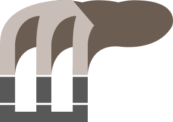
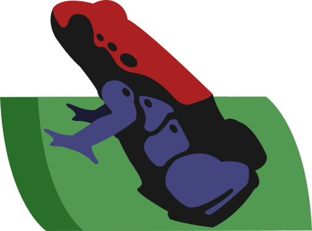
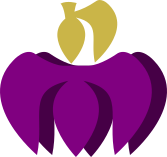

# POISN
Network-Shared I/O Protocol: 
Allowing for custom frontend UI and cross-application data streaming.

# Network-Shared I/O Protocol API definition

### Poisn is an Application Layer Protocol for multi-end communication:

The structure that this protocol supports consists of a central server and an arbitrary number of connected nodes.

    N N N      Peer Nodes
     \|/
      S        Server
      |
      N        Client Node

### Communication Patterns:
Nodes communicate with the central server, and the server relays the data to all other connected nodes over a persistent TCP connection. The data can be treated as would a standard input/output buffer, or integrated with a frontend UI that implements the POISN chat API.

The standard communication pattern consists of a
***header field***
and
***data field***
that contain context-specific information.

    HEAD: header identifies the format of the message
    DATA: data field contains all text to be transfered to the server or to node.

## Standard Server-Client Variations

* **General Prompt/Response**

        HEAD: General
        <Plaintext>

    * User Identification
    * User Authenication
    * Host Selection Response
    * Node Query
    * History Query
  

* **Host Query**

        HEAD: `Q HOST`
        <List of hosts associated with user>
 

* **Node Query Response**

        HEAD: `Q NODE`
        <List of active nodes>
 

* **History Query Response**

        HEAD: `Q HIST`
        <List of messages since queried history index>
 

## Standard Relayed Variations

* **Plaintext Message**

        HEAD: `R TEXT`
        <Plaintext message>
 

* **Link Message**

        HEAD: `R LINK`
        <Plaintext link URL>
 

* **File Encoding Message**

        HEAD: `R FILE <filetype>`
        <Byte encoding of file>

 

## Clients and Dependencies
 

### Miasma Client
* Tkinter
* Contextlib

 

### DartFrog Client

 

### Nightshade Client

 

## Contributors
Matthew Tiemersma - mtiemersma19@georgefox.edu 
Kevin Lockwood - klockwood19@georgefox.edu 
Dylan Rainey - drainey19@georgefox.edu 
Luke Gantar - lgantar19@georgefox.edu 

## Licensing
Copyright (c) 2022, the POISN developers. 
SPDX-License-Identifier: BSD-2-Clause
